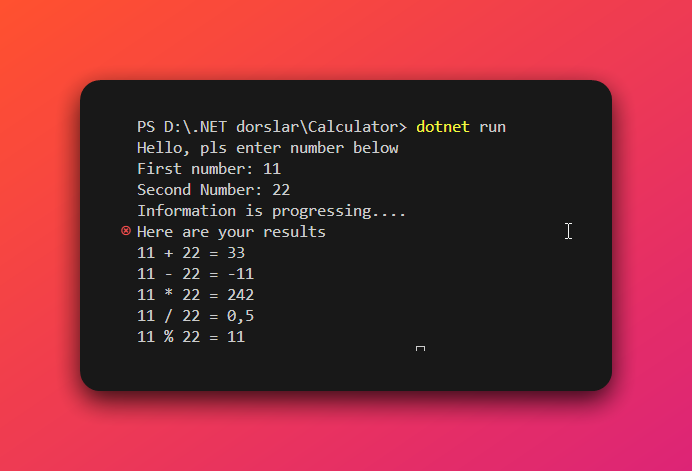

# Calculator

## Overview 

This project shows how to use succesefully use datatypes and arifmetic opirations

Have a look at __Program.cs__ file and you can see how I used:

+ Console input/output
+ Conversion between data types 
+ Arithmetic operations

## Demo

## Other info

If you want to see more project just click **[here](https://github.com/Imron0250)**
